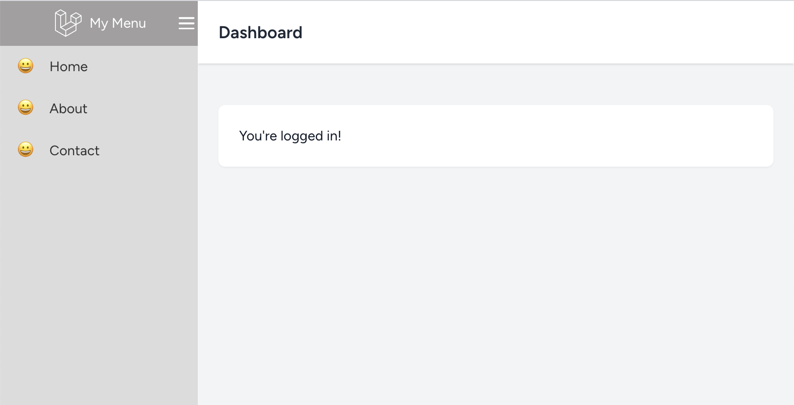
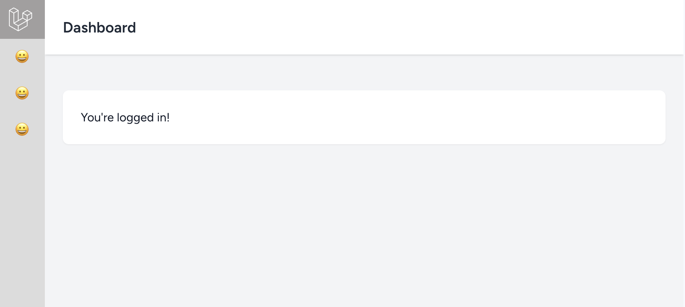

# Admin Frame / Sidebar
Sample link - http://benpsk.github.io/template/

No libraries, no frameworks, just pure HTML, CSS, and a bit of vanilla JavaScript.

Here's what you need to do:

1. Copy the content of the `index.html` file.

2. Copy the `theme-style.css`.

3. Copy the `theme-app.js`.

That's all. Enjoy!

Here is a sample setup for the [Laravel Framework](https://github.com/benpsk/template/tree/laravel).